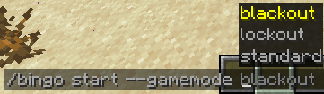

# Bingo

A Bingo mod that displays the bingo board on players' screens and tracks progress in real time. 

## Features

- A bingo board rendered in the corner of the screen: 

  

- Different gamemodes:

  

- Tracking the progress of goals:

  

- Vanilla friendly:

  

## Installation

### Fabric

1. [Install Fabric](https://fabricmc.net/use/).
2. Download [Fabric API](https://modrinth.com/mod/fabric-api) and put it in your mods folder.
3. Download the Bingo mod from [Modrinth](https://modrinth.com/mod/bingo-mod), and put it in your mods folder.

### NeoForge

1. [Install NeoForge](https://neoforged.net/).
2. Download the Bingo mod from [Modrinth](https://modrinth.com/mod/bingo-mod), and put it in your mods folder.

## Usage

The Bingo mod works with vanilla teams. Use `/bingo teams create <color>` to create a new team, and `/bingo teams randomize` to add a player to a team. The Bingo mod also uses the [Vanilla teams system](https://minecraft.wiki/w/Scoreboard#Teams), so you can use the Vanilla [`/team` command](https://minecraft.wiki/w/Commands/team) to manage teams as well.

To start a game, use `/bingo start [options...] <teams...>`. For example, if you want to start a bingo game between two teams called `red` and `blue` with default settings,
you can use `/bingo start red blue`. 
Here is a more complicated example with a smaller board and easier goals: `/bingo start --difficulty bingo:easy --size 3 red blue`.

## Datapacks

The Bingo mod's goals, difficulties, and tags (used in board generation) are entirely data-driven and can be modified with datapacks. For examples of the formats of these, check the mod's [default data folder](common/src/main/generated/data).

## Credits

Many of the goals this Bingo mod adds originally come from v4 of the [mcbingo](https://minecraftbingo.com/) website.

## Contributing

The process of contributing is the same as for any other Minecraft mod. Please ask before making any large changes.
